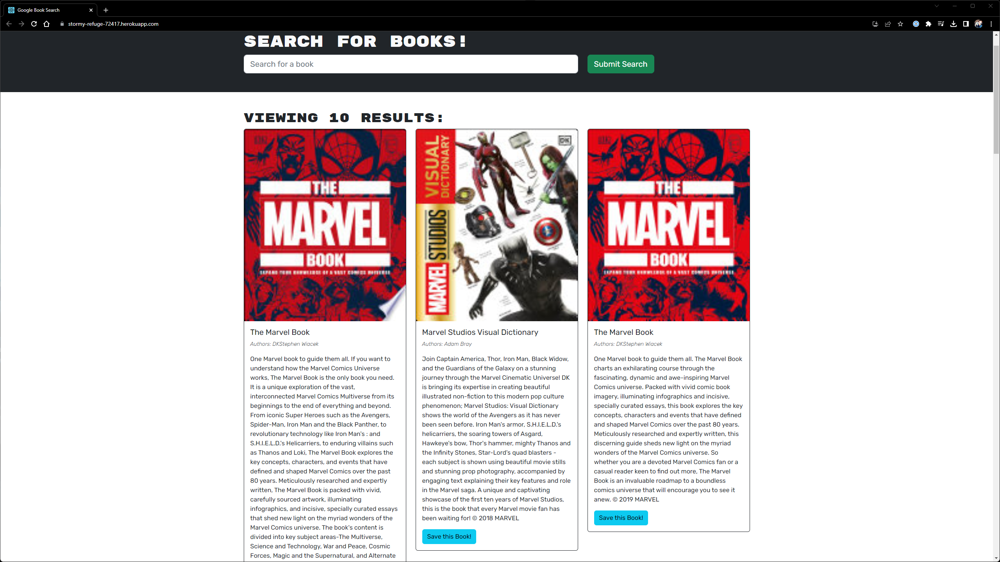

# Book Search

## Description

The purpose of this project was to build a page where users can search and save their favorite books, or books that the user wishes to read at some point. This is a very intuitive app to use and can be used to store a wishlist or 'To-Read' list saved on a website.

## Installation

The github repository is available at https://github.com/zachcygan/book-search. Be sure to install any dependencies by typing in "npm i" in the console.

## Dependencies Used
    - bcrypt
    - apollo-server-express
    - connect-session-sequelize
    - express
    - graphql
    - jsonwebtoken
    - mongoose
    - npm
    - bookstrap
    - @apollo/client
    - jwt-decode

## Instructions

When the site first launches, users will have the ability to search for books, but will not be able to save any unless they create an account first. To create an account, click 'Login/Sign Up' and follow the instructions. Once an account is created, you will be redirected to the homepage at which point you can search and save books. The user can view any books they have saved by clicking 'See Your Books' on the top right of the page. Once viewing the saved books, users will be able to remove any books from their collection by clicking 'remove'.

## Deployed Application

You can find the deployed application here: https://powerful-oasis-02592.herokuapp.com/

## Screenshots

